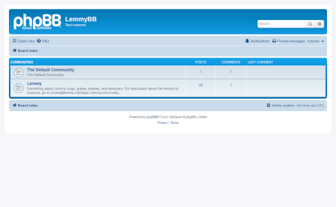
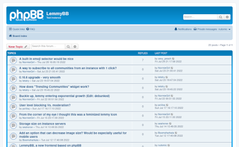
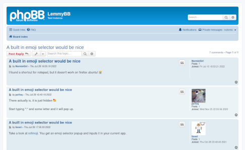

# lemmyBB

[](https://cloud.drone.io/LemmyNet/lemmyBB)

A Lemmy frontend based on [phpBB 3.3](https://www.phpbb.com/).

## Screenshots





## Instances

Here is a list of known lemmyBB instances:

| Domain                                                             | Registration | lemmy-ui domain                                                | Notes                   |
|--------------------------------------------------------------------|--------------|----------------------------------------------------------------|-------------------------|
| [lemmybb.lemmy.ml](https://lemmybb.lemmy.ml/)                      | open         | [lemmyui.lemmy.ml](https://lemmyui.lemmy.ml/)                  | developer test instance |
| [lemmybb.rollenspiel.monster](https://lemmybb.rollenspiel.monster) | open         | [lemmy.rollenspiel.monster](https://lemmy.rollenspiel.monster) | topic role play         |

Please open a pull request if you know another instance.

## Installation

### New installation (docker-compose)

Follow these instructions to setup a new Lemmy installation on your server, with both lemmybb (for users) and lemmy-ui (mainly for moderation features which are not supported in lemmybb yet). 

Install dependencies and create folders:
```
apt install docker-compose docker.io nginx certbot python3-certbot-nginx
mkdir /srv/lemmybb
cd /srv/lemmybb
mkdir volumes/pictrs
chown 991:991 volumes/pictrs/
```

Download config files, edit lemmy.hjson with your actual domain and make other changes if desired:
```
wget https://raw.githubusercontent.com/LemmyNet/lemmyBB/main/docker/docker-compose.yml
wget https://raw.githubusercontent.com/LemmyNet/lemmyBB/main/docker/lemmy.hjson
nano lemmy.hjson 
```

Start docker-compose services 
```
docker-compose up -d
```

Request tls certificates (use your actual domains and email)
```
certbot certonly --nginx -d lemmybb.com -m contact@lemmybb.com
certbot certonly --nginx -d lemmyui.com -m contact@lemmyui.com
```

Install nginx config and set correct domains. Note that this config by default doesn't allow direct access to the API nor pictrs. This makes it harder for spam bots, but also means that Lemmy clients cant be used. The nginx config includes instructions for putting lemmy-ui behind HTTP Auth, so that only admins can access it.
```
wget https://raw.githubusercontent.com/LemmyNet/lemmyBB/main/docker/nginx.conf -O /etc/nginx/sites-enabled/lemmybb.conf
sed -i -e 's/$lemmybb_domain/lemmybb.com/g' /etc/nginx/sites-enabled/lemmybb.conf
sed -i -e 's/$lemmyui_domain/lemmyui.com/g' /etc/nginx/sites-enabled/lemmybb.conf
nginx -s reload
```

Add these lines to daily cronjob (sudo crontab -e) to renew tls certificates
```
@daily certbot certonly --nginx -d lemmybb.com --deploy-hook 'nginx -s reload'
@daily certbot certonly --nginx -d lemmyui.com --deploy-hook 'nginx -s reload'
```

### Alongside existing Lemmy instance (native)

Follow the [Lemmy installation instructions](https://join-lemmy.org/docs/en/administration/administration.html) to install Lemmy backend and lemmy-ui first. You will need one (sub)domain for LemmyBB, and another for lemmy-ui.

Then install lemmyBB itself. First, ssh into your server and prepare by cloning the code repository.
```
cd /opt
git clone https://github.com/LemmyNet/lemmyBB.git
```

Change to the folder and compile Lemmy.
```
cd lemmyBB
cargo build --release
```

Copy the nginx config into the sites-enabled folder and edit it
```
cp docker/nginx-lemmybb.conf /etc/nginx/sites-enabled/lemmybb.conf
```

create systemd service file
```
nano /etc/systemd/system/lemmy_bb.service
```

and insert the following content and adapt 'LEMMY_BB_BACKEND' and 'LEMMY_BB_LISTEN_ADDRESS' to your installation
```
[Unit]
Description=lemmy_bb
After=network.target

[Service]
Type=simple
WorkingDirectory=/opt/lemmyBB/
Environment="LEMMY_BB_BACKEND=http://127.0.0.1:8536"
Environment="LEMMY_BB_LISTEN_ADDRESS=127.0.0.1:8703"
Environment="LD_PRELOAD=libjemalloc.so"
ExecStart=/opt/lemmyBB/target/release/lemmy_bb
Restart=always

[Install]
WantedBy=multi-user.target
```

then activate and start the service and check the status
```
systemctl enable --now lemmy_bb.service
systemctl status lemmy_bb.service
```

Run the following commands to update lemmyBB to the latest development version.
```
cd /opt/lemmyBB
git pull
cargo build --release
systemctl restart lemmy_bb.service
```

## Configuration

### Environment variables

| var                           | default value         | description                                                                                                                |
|-------------------------------|-----------------------|----------------------------------------------------------------------------------------------------------------------------|
| LEMMY_BB_BACKEND              | http://localhost:8536 | Protocol, hostname and port where lemmy backend is available                                                               |
| LEMMY_BB_LISTEN_ADDRESS       | 127.0.0.1:1244        | IP and port where lemmyBB listens for requests                                                                             |
| LEMMY_BB_INCREASED_RATE_LIMIT |                       | Set this variable if rate limits of Lemmy backend are increased as in docker/lemmy.hjson. Necessary to render last replies |

### Frontpage

Create a file `lemmybb_categories.hjson` with content like the following:
```json
[
  [
    "General"
    [
      "!main@voyager.lemmy.ml"
      "!lemmybb@lemmy.ml"
    ]
  ]
  [
    "Open Source"
    [
      "https://lemmy.ml/c/opensource"
      "https://lemmy.ml/c/linux"
      "https://lemmy.ml/c/rust"
    ]
  ]
]
```
Note, you must subscribe manually to remote communities, so that new activities are federated to your instances.

## Development

Execute the following command, with a Lemmy instance of your choice:
```
LEMMY_BB_BACKEND=https://lemmy.ml cargo run
```

You can also run a local development instance of Lemmy, either [native](https://join-lemmy.org/docs/en/contributing/local_development.html) or in [Docker](https://join-lemmy.org/docs/en/contributing/docker_development.html), and connect to it with:

```
LEMMY_BB_BACKEND=http://localhost:8536 cargo run
```

## License

The project is licensed under [AGPLv3](LICENSE).

Theme files from phpBB are licensed under [GPLv2](https://www.phpbb.com/downloads/license).
